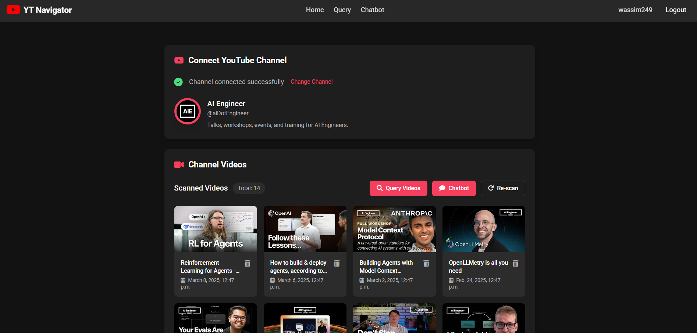
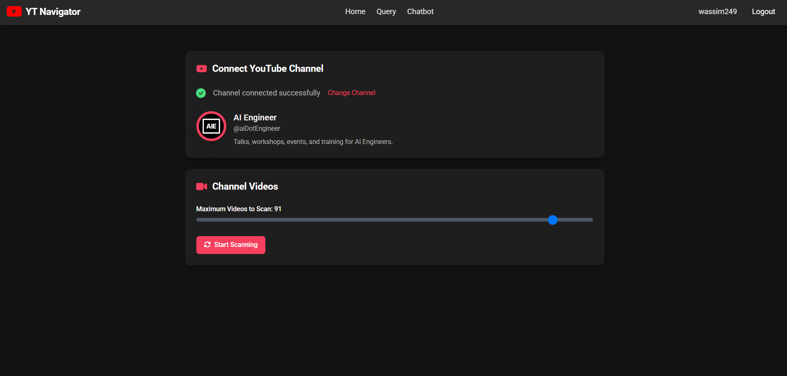
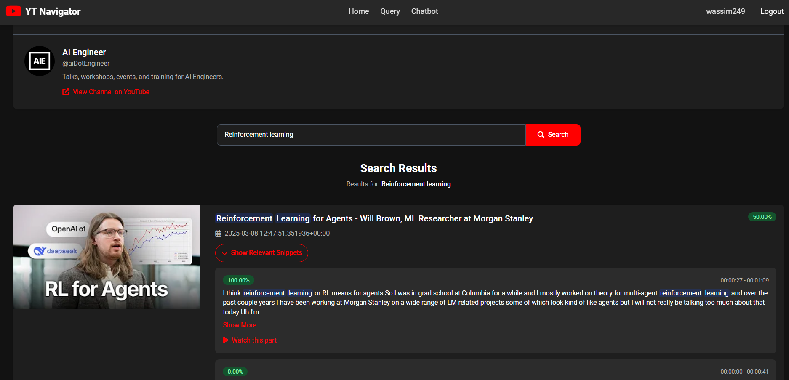
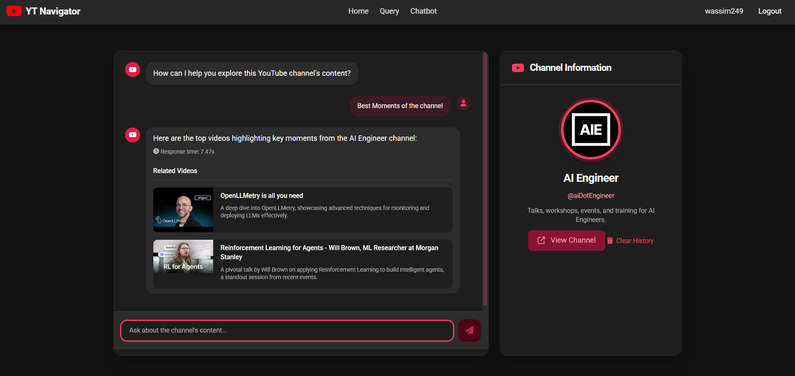

# 🔴 YT Navigator



## 📋 Overview

YT Navigator is an AI-powered application that helps you navigate and search through YouTube channel content efficiently. Instead of manually watching hours of videos to find specific information, YT Navigator allows you to:

1. **🔍 Search through a channel's videos** using natural language queries
2. **💬 Chat with a channel's content** to get answers based on video transcripts
3. **⏱️ Discover relevant video segments** with precise timestamps

Perfect for researchers, students, content creators, or anyone who needs to extract information from YouTube channels quickly.

## ✨ Main Features

- **🔐 Authentication**: Secure login and independent sessions
- **📺 Channel Management**: Scan up to 100 videos per channel and get a summary of the channel
- **🔍 Search**: Find relevant video segments using Semantic Search
- **💬 Chat**: Have conversations with an AI that has knowledge of the channel's content

### 1- 📥 Channel data retrieval


For this part, the user enters a YouTube channel URL which the system validates before extracting the channel username. The system then fetches channel details including title, description, and profile picture, storing them in the database.

After connecting to a channel, the user selects how many videos to scan (up to 100). The system then processes these videos in parallel through two paths:
1. 📊 Video metadata is extracted and saved to a relational database (PostgreSQL)
2. 📝 Video transcripts are extracted, split into segments, converted to vector embeddings, and stored in a vector database (PGVector)

Once both processes are complete, the channel content becomes available for search and chat functionality.

<details>
<summary><strong>Click to show/hide the Channel Data Retrieval Flow Diagram</strong></summary>

```mermaid
graph TD
    A[User enters YouTube Channel URL] --> B[Validate URL]
    B --> C[Fetch Channel Details]
    C --> G[User selects number of videos to scan]
    G --> H[Fetch Video Details]
    H --> I[Process Video Metadata]
    
    H --> J[Extract Video Transcripts]
    I --> K1[Save to Relational Database]
    J --> L[Split into Video Segments]
    L --> M[Generate Embeddings]
    M --> K2[Add to Vector Database]
    K1 --> N[Channel Ready for Search/Chat]
    K2 --> N
```
</details>

### 2 - 🔍 Querying the channel


The querying process begins when a user enters a natural language query to search across the channel's content. The system processes this query through both semantic search (using vector embeddings) and keyword search (using BM25) for comprehensive results. These results are combined, enriched with video metadata from the relational database, and deduplicated. A cross-encoder model then reranks the results based on relevance to the query. The system standardizes relevance scores, groups results by video, and returns the most relevant videos along with specific transcript segments. The user interface displays these results with video thumbnails, titles, relevant transcript segments, and direct links to the exact timestamps in the videos where the information appears.

<details>
<summary><strong>Click to show/hide the Query Flow Diagram</strong></summary>

```mermaid
graph TD
    A[User enters natural language query] --> D1[Perform semantic search]
    A --> D2[Perform keyword search]
    D1 --> E[Combine search results]
    D2 --> E
    E --> F[Fetch video metadata]
    F --> H[Remove duplicates]
    H --> I[Rerank results]
    I --> J[Standardize scores]
    J --> L[Return top videos and segments]
```
</details>

### 3 - 💬 Chat with the channel


The chat interface facilitates interactive conversations with an AI agent knowledgeable about the channel's content, utilizing the ReAct framework. When a user sends a message, the system processes it through a decision-making mechanism to identify the appropriate response type. The message can be addressed in three ways: 
1) 🔄 A direct response without tool calls for general inquiries, 
2) ⛔ A static response for irrelevant questions, 
3) 🛠️ A tool-assisted response that queries the vector database to extract specific information from video transcripts. In the case of tool-assisted responses, the agent engages in a cycle where it employs its tools (semantic search and SQL Select query execution) to gather information before crafting a comprehensive answer.

This process mitigates hallucinations and allows for the use of smaller models in handling complex tasks.

<details>
<summary><strong>Click to show/hide the Chat Flow Diagram</strong></summary>

```mermaid
graph TD
    A[__start__] --> B[route_message 
    llama-3.1-8b-instant]
    
    B -.-> C[non_tool_calls_reply
    llama-3.1-8b-instant]
    B -.-> D[static_not_relevant_reply
    llama-3.1-8b-instant]
    B -.-> E[tool_calls_reply
    qwen-qwq-32b]
    
    subgraph React Agent qwen-qwq-32b
        E1[__start__] --> E2[agent]
        E2 -.continue.-> E3[tools]
        E2 -.end.-> E4[__end__]
        E3 --> E2
    end
    
    C --> F[__end__]
    D --> F
    E --> F
```
</details>


## 🧰 Technology Stack

- **🖥️ Backend**:
  - Django (Python)
  - PostgreSQL
  - Structlog for logging
  - Pydantic for data validation
- **🧠 AI & ML**: 
  - [LangGraph](https://www.langchain.com/langgraph) for conversational AI
  - [Sentence Transformers](https://www.sentence-transformers.org/) for semantic search
  - [PGVector](https://www.pgvector.org/) as a vector database
  - [BM25](https://en.wikipedia.org/wiki/Okapi_BM25) for keyword search
  - [bge-small-en-v1.5](https://huggingface.co/sentence-transformers/BAAI/bge-small-en-v1.5) for embeddings
  - qwen-qwq-32b and llama-3.1-8b-instant from [Groq](http://groq.com/)
- **⚙️ Data Processing**:
  - [Scrapetube](https://github.com/dermasmid/scrapetube) for scraping videos
  - [youtube-transcript-api](https://pypi.org/project/youtube-transcript-api/) for obtaining transcripts
- **🎨 Frontend**: 
  - Django templates with modern CSS
  - Responsive design

## 🚀 Installation

### 💻 Without Docker

1. Clone the repository
```bash
git clone https://github.com/wassim249/YT-Navigator
```

2. Create a virtual environment and install dependencies
```bash
python -m venv venv
source venv/bin/activate
pip install -e .
```

3. Make sure you have a PostgreSQL database running.

4. Create a `.env` file in the root directory from the `.env.example` file.
```bash
cp .env.example .env
```

5. Create Django migrations and migrate the database
```bash
python manage.py migrate
```

6. Run the development or production server
```bash
make dev # for development
make prod # for production
```
### 🐳 With Docker
To be implemented.

## 📖 Usage

### 1. 📝 Register and Login

Create an account to get started.

### 2. 🔗 Connect a YouTube Channel

On the home page, enter a YouTube channel URL to connect to it. The system will fetch the channel's information.

### 3. 📥 Scan Videos

After connecting a channel, you can scan its videos. Choose how many videos to scan (more videos = more comprehensive results but longer processing time).

### 4. 🔍 Search for Information

Use the search feature to find specific information across all scanned videos. The system will return:
- 🎯 Relevant video segments with timestamps
- 📝 Transcripts of the matching content
- 🔗 Links to watch the videos at the exact timestamps

### 5. 💬 Chat with the Channel

Use the chatbot interface to have a conversation about the channel's content. The AI will respond based on the information in the scanned videos.

## 👨‍💻 Development

### 📁 Project Structure

- `app/`: Main Django application
  - `models/`: Database models (Channel, Video, VideoChunk)
  - `views/`: View functions for web pages and API endpoints
  - `services/`: Core functionality (scraping, vector database, AI agent)
  - `templates/`: HTML templates
  - `static/`: CSS, JavaScript, and other static files

- `yt_navigator/`: Django project settings and configuration

### 🛠️ Using the Makefile

The project includes a Makefile with useful commands:
Run `make help` to see the available commands.
```bash
make help
```

## 🗺️ Roadmap

- [ ] 🐳 Add Docker support
- [ ] ✅ Add tests
- [ ] 📋 Add support for playlist/shorts scanning
- [ ] 📱 Improve mobile experience
- [ ] 🌐 Add support for multiple languages

## 🤝 Contributing

Contributions are welcome! Please feel free to submit a Pull Request.

1. Fork the repository
2. Create your feature branch (`git checkout -b feature/amazing-feature`)
3. Commit your changes (`git commit -m 'Add some amazing feature'`)
4. Push to the branch (`git push origin feature/amazing-feature`)
5. Open a Pull Request

## 📄 License

This project is licensed under the MIT License - see the LICENSE file for details.

## 🤵 Author

- [wassim249](https://github.com/wassim249)
